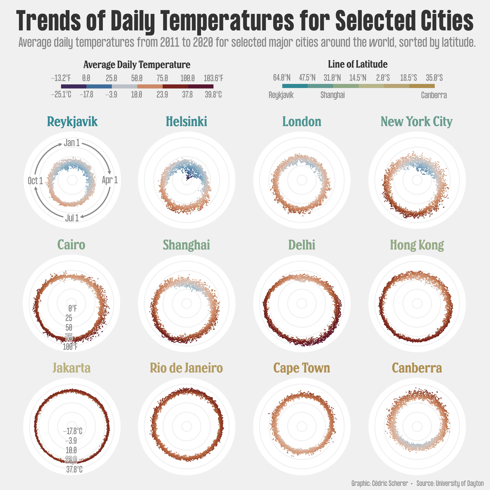
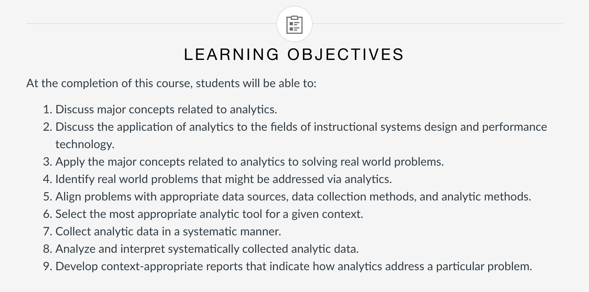

```{r setup, include=FALSE}
usethis::use_git_ignore(c("*.csv", "*.rds"))
options(htmltools.dir.version = FALSE)

library(knitr)
library(tidyverse)
library(xaringan)
library(fontawesome)
```

class: inverse, center, middle

# `r fa("far fa-images", fill = "#fff")`

**View the slides:** 

[bretsw.github.io/eme6356-ss22-module8](https://bretsw.github.io/eme6356-ss22-module8)

---

# `r fa("fas fa-comment-dots", fill = "#fff")` Data Stories

```{r, out.width = "360px", echo = FALSE, fig.align = "center"}

```

>Circular #dataviz showing average daily temperatures around the year for selected cities of the world, sorted by latitude (plus an alternative version sorted by overall average in the 🧵). Made with #rstats + #ggplot2 and #Figma.

(Tweet from [@CedScherer](https://twitter.com/CedScherer/status/1513964792461074437))

---

# `r fa("fas fa-comment-dots", fill = "#fff")` Data Stories

```{r, out.width = "560px", echo = FALSE, fig.align = "center"}

```

---

class: inverse, center, middle

# `r fa("thumbs-up", fill = "#fff")` <br><br> Module 7 Discussion <br> Themes and Kudos

---

class: inverse, center, middle

# `r fa("far fa-question-circle", fill = "#fff")` <br><br> Module 7 Discussion <br> Final Thoughts?

---

class: inverse, center, middle

# `r fa("fas fa-angle-double-left", fill = "#fff")` <br><br> EME6356 In Review

---

# `r fa("fas fa-angle-double-left", fill = "#fff")` EME6356 Learning Objectives

```{r, out.width = "100%", echo = FALSE, fig.align = "center"}

```

(See the [course syllabus](https://canvas.fsu.edu/courses/195595/assignments/syllabus))

---

# `r fa("fas fa-angle-double-left", fill = "#fff")` Course Objective 1

--

### Discuss major concepts related to analytics.

--

1.1 Understand the basic steps in the analytics process: measure, collect, analyze, and report.

--

1.2 Understand and analyze foundational analytics concepts.

--

5.1 Understand and analyze applications of data visualization for telling analytics stories.

---

# `r fa("fas fa-angle-double-left", fill = "#fff")` Course Objective 2

### Discuss the application of analytics to the fields of instructional systems design and performance technology.

--

2.1 Understand and analyze applications of analytics for improving performance at home and at work.

--

3.1 Understand and analyze applications of analytics for improving performance in educational settings (K12 to higher ed; formal to informal).

--

4.1 Understand and analyze applications of analytics for evaluating online activity.

--

6.1 Understand and analyze ethical considerations and challenges for using analytics.

--

7.1 Understand and analyze trends and future directions of analytics.

--

8.1 Analyze presentations of how analytics have been or may be applied to solving a real-world problem.

---

# `r fa("fas fa-angle-double-left", fill = "#fff")` Course Objective 3

### Apply the major concepts related to analytics to solving real world problems.

--

3.2 Create an analytics plan that identifies and describes a real-world problem and explains how analytics might be used to address the problem through data collection, data analysis, and reporting phases.

--

5.2 Create an analytics report that identifies a data source, accesses/collects the data, analyzes it, generates data visualizations, and tells its story.

--

7.2 Evaluate a situation in which analytics have been or may be applied to solving a real-world problem and create a compelling presentation of your evaluation.

--

8.2 Create an ethics report that identifies and describes ethical considerations related to using analytics to solve a real-world problem and explains specific ethical concerns of data collection, data analysis, and reporting phases.

---

# `r fa("fas fa-angle-double-left", fill = "#fff")` Course Objective 4

### Identify real world problems that might be addressed via analytics.

--

3.2 Create an analytics plan that identifies and describes a real-world problem and explains how analytics might be used to address the problem through data collection, data analysis, and reporting phases.

--

5.2 Create an analytics report that identifies a data source, accesses/collects the data, analyzes it, generates data visualizations, and tells its story.

--

7.2 Evaluate a situation in which analytics have been or may be applied to solving a real-world problem and create a compelling presentation of your evaluation.

--

8.2 Create an ethics report that identifies and describes ethical considerations related to using analytics to solve a real-world problem and explains specific ethical concerns of data collection, data analysis, and reporting phases.

---

# `r fa("fas fa-angle-double-left", fill = "#fff")` Course Objective 5

### Align problems with appropriate data sources, data collection methods, and analytic methods.

--

3.2 Create an analytics plan that identifies and describes a real-world problem and explains how analytics might be used to address the problem through data collection, data analysis, and reporting phases.

--

5.2 Create an analytics report that identifies a data source, accesses/collects the data, analyzes it, generates data visualizations, and tells its story.

--

7.2 Evaluate a situation in which analytics have been or may be applied to solving a real-world problem and create a compelling presentation of your evaluation.

--

8.2 Create an ethics report that identifies and describes ethical considerations related to using analytics to solve a real-world problem and explains specific ethical concerns of data collection, data analysis, and reporting phases.

---

# `r fa("fas fa-angle-double-left", fill = "#fff")` Course Objective 6

### Select the most appropriate analytic tool for a given context.

--

3.2 Create an analytics plan that identifies and describes a real-world problem and explains how analytics might be used to address the problem through data collection, data analysis, and reporting phases.

--

5.2 Create an analytics report that identifies a data source, accesses/collects the data, analyzes it, generates data visualizations, and tells its story.

--

7.2 Evaluate a situation in which analytics have been or may be applied to solving a real-world problem and create a compelling presentation of your evaluation.

--

8.2 Create an ethics report that identifies and describes ethical considerations related to using analytics to solve a real-world problem and explains specific ethical concerns of data collection, data analysis, and reporting phases.

---

# `r fa("fas fa-angle-double-left", fill = "#fff")` Course Objective 7

### Collect analytic data in a systematic manner.

--

3.2 Create an analytics plan that identifies and describes a real-world problem and explains how analytics might be used to address the problem through data collection, data analysis, and reporting phases.

--

5.2 Create an analytics report that identifies a data source, accesses/collects the data, analyzes it, generates data visualizations, and tells its story.

--

7.2 Evaluate a situation in which analytics have been or may be applied to solving a real-world problem and create a compelling presentation of your evaluation.

---

# `r fa("fas fa-angle-double-left", fill = "#fff")` Course Objective 8

### Analyze and interpret systematically collected analytic data.

--

3.2 Create an analytics plan that identifies and describes a real-world problem and explains how analytics might be used to address the problem through data collection, data analysis, and reporting phases.

--

5.2 Create an analytics report that identifies a data source, accesses/collects the data, analyzes it, generates data visualizations, and tells its story.

--

7.2 Evaluate a situation in which analytics have been or may be applied to solving a real-world problem and create a compelling presentation of your evaluation.

---

# `r fa("fas fa-angle-double-left", fill = "#fff")` Course Objective 9

### Develop context-appropriate reports that indicate how analytics address a particular problem.

--

3.2 Create an analytics plan that identifies and describes a real-world problem and explains how analytics might be used to address the problem through data collection, data analysis, and reporting phases.

--

5.2 Create an analytics report that identifies a data source, accesses/collects the data, analyzes it, generates data visualizations, and tells its story.

--

8.2 Create an ethics report that identifies and describes ethical considerations related to using analytics to solve a real-world problem and explains specific ethical concerns of data collection, data analysis, and reporting phases.

---

class: inverse, center, middle

# `r fa("fas fa-road", fill = "#fff")` <br><br> Looking Back, Looking Ahead

---

class: inverse, center, top

# `r fa("fas fa-road", fill = "#fff")` Looking Back, Looking Ahead

<div class="padlet-embed" style="border:1px solid rgba(0,0,0,0.1);border-radius:2px;box-sizing:border-box;overflow:hidden;position:relative;width:100%;background:#F4F4F4"><p style="padding:0;margin:0"><iframe src="https://fsu.padlet.org/embed/tko9avv5ldaixa8w" frameborder="0" allow="camera;microphone;geolocation" style="width:100%;height:480px;display:block;padding:0;margin:0"></iframe></p><div style="padding:8px;text-align:right;margin:0;"><a href="https://padlet.com?ref=embed" style="padding:0;margin:0;border:none;display:block;line-height:1;height:16px" target="_blank"></a></div></div>

---

class: inverse, center, middle

# `r fa("fas fa-tools", fill = "#fff")` <br><br> Data Analytics Tools

---

class: inverse, center, top

# `r fa("fas fa-tools", fill = "#fff")` Data Analytics Tools

<div class="padlet-embed" style="border:1px solid rgba(0,0,0,0.1);border-radius:2px;box-sizing:border-box;overflow:hidden;position:relative;width:100%;background:#F4F4F4"><p style="padding:0;margin:0"><iframe src="https://fsu.padlet.org/embed/xxl6opndte57rmc5" frameborder="0" allow="camera;microphone;geolocation" style="width:100%;height:480px;display:block;padding:0;margin:0"></iframe></p><div style="padding:8px;text-align:right;margin:0;"><a href="https://padlet.com?ref=embed" style="padding:0;margin:0;border:none;display:block;line-height:1;height:16px" target="_blank"></a></div></div>

---

class: inverse, center, middle

# `r fa("fas fa-binoculars", fill = "#fff")` <br><br> Looking Ahead

---

# `r fa("fas fa-calendar-alt", fill = "#fff")` Semester schedule

```{r, out.width = "100%", echo = FALSE, fig.align = "center"}
include_graphics("img/across-time.jpg")
```

- **Module 8:** Case Discussions - **ends April 24**

---

# `r fa("fas fa-calendar-alt", fill = "#fff")` Major Assignments

```{r, out.width = "600px", echo = FALSE, fig.align = "center"}
include_graphics("img/build.jpg")
```

### Analytics Assignments

- Analytics Ethics Statement (100 points) - **due April 24**

---

class: inverse, center, middle

# `r fa("far fa-question-circle", fill = "#fff")` <br><br> Questions

<hr>

**What questions can I answer for you now?**

**How can I support you this week?**

<hr>

`r fa("envelope", fill = "#fff")` [bret.staudtwillet@fsu.edu](mailto:bret.staudtwillet@fsu.edu) | `r fa("twitter", fill = "#fff")` [@bretsw](https://twitter.com/bretsw) | `r fa("globe", fill = "#fff")` [bretsw.com](http://bretsw.com) | `r fa("fab fa-github", fill = "#fff")` [GitHub](https://github.com/bretsw/)